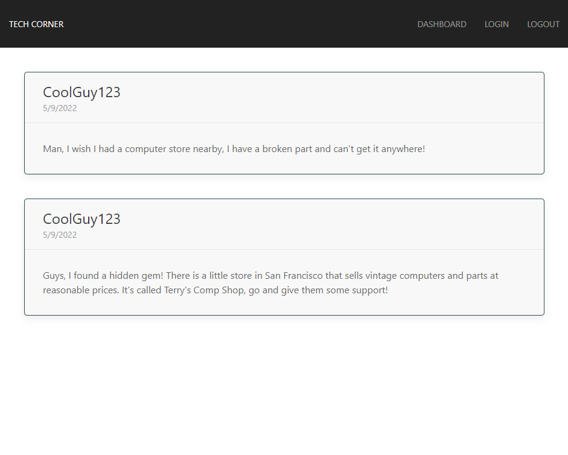
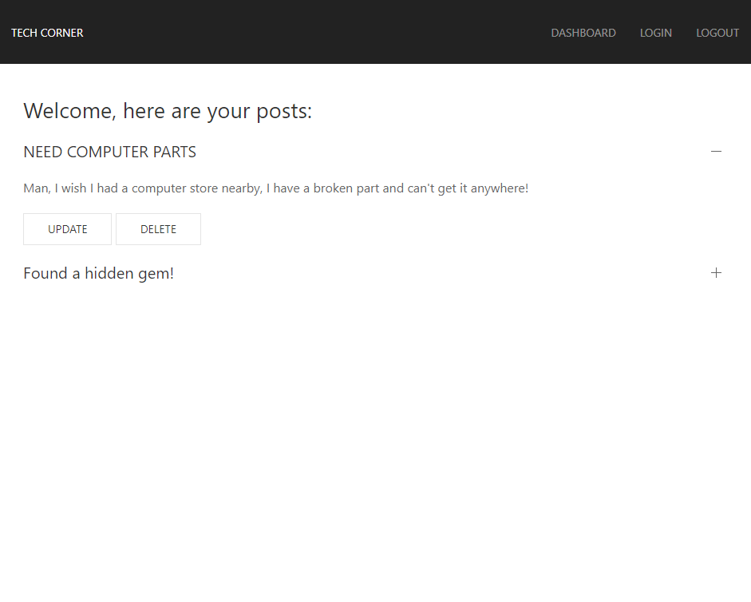

# Tech Corner
 

 

## <ins> Table of Contents: </ins>

- [Questions](#-questions-)
- [Description](#-description-)
- [Installation](#-installation-)
- [Usage](#-usage-)
- [Technologies and Programs Used](#-technologies-and-programs-used-)
- [Demonstration](#-demonstration-)
- [Links](#-links-)
- [Credits](#-credits-)
- [License](#-license-)
    

## <ins> Questions? </ins>

### By [Sfzmango](https://github.com/Sfzmango)
### Email: maunghtike1999@gmail.com
 

## <ins> Description: </ins>
        
This is a program constructed with Javascript and utilizes Node.js. It features usage of the Express.js, MySQL2, DotEnv, Sequelize, Handlebars, and Bcrypt packages to create a blog site for users to post their thoughts.
        

## <ins> Installation: </ins>
        
Please download all the files included in the repository. Afterwards, please open your terminal into the repository folder and utilize Node.js's npm install feature to install all the used packages. Then, load up mysql and enter your password. Source the schema file and quit.
 ***npm i*** 
 ***mysql -u root -p*** 
 ***source db/schema.sql*** 

## <ins> Usage: </ins>
        
To start the program, please open the perfect-readme directory on terminal and type in ***npm start***. You will then be able to go to the proper routes to see the webpage. If you would like to post something onto the website, please make an account under the login section.
      

## <ins> Technologies and Programs Used: </ins>

- CSS
    - Bootstrap
- Javascript
    - Node.js
    - Express.js
        - Express-Handlebars
        - Express-Session
    - MySQL2
    - DotEnv
    - Sequelize
        - Connect-Session-Sequelize 
    - Handlebars
    - Bcrypt
- VS Code
- Git/Github
- Heroku

## <ins> Demonstration: </ins>
        
### Home Page:

 

### Login Page:

 

### Dashboard:

     

## <ins> Links: </ins>
        
- [Github Repository](https://github.com/Sfzmango/tech-corner)
- [Github Deployed Page](https://sfzmango.github.io/tech-corner/)
- [Heroku Deployed Page](https://mh-tech-corner.herokuapp.com/)

       

## <ins> Credits: </ins>

Credits: 
Maung Htike
  

## <ins> License: </ins>
        
 

MIT License

Copyright (c) 2022 Maung Htike

Permission is hereby granted, free of charge, to any person obtaining a copy
of this software and associated documentation files (the "Software"), to deal
in the Software without restriction, including without limitation the rights
to use, copy, modify, merge, publish, distribute, sublicense, and/or sell
copies of the Software, and to permit persons to whom the Software is
furnished to do so, subject to the following conditions:

The above copyright notice and this permission notice shall be included in all
copies or substantial portions of the Software.

THE SOFTWARE IS PROVIDED "AS IS", WITHOUT WARRANTY OF ANY KIND, EXPRESS OR
IMPLIED, INCLUDING BUT NOT LIMITED TO THE WARRANTIES OF MERCHANTABILITY,
FITNESS FOR A PARTICULAR PURPOSE AND NONINFRINGEMENT. IN NO EVENT SHALL THE
AUTHORS OR COPYRIGHT HOLDERS BE LIABLE FOR ANY CLAIM, DAMAGES OR OTHER
LIABILITY, WHETHER IN AN ACTION OF CONTRACT, TORT OR OTHERWISE, ARISING FROM,
OUT OF OR IN CONNECTION WITH THE SOFTWARE OR THE USE OR OTHER DEALINGS IN THE
SOFTWARE.